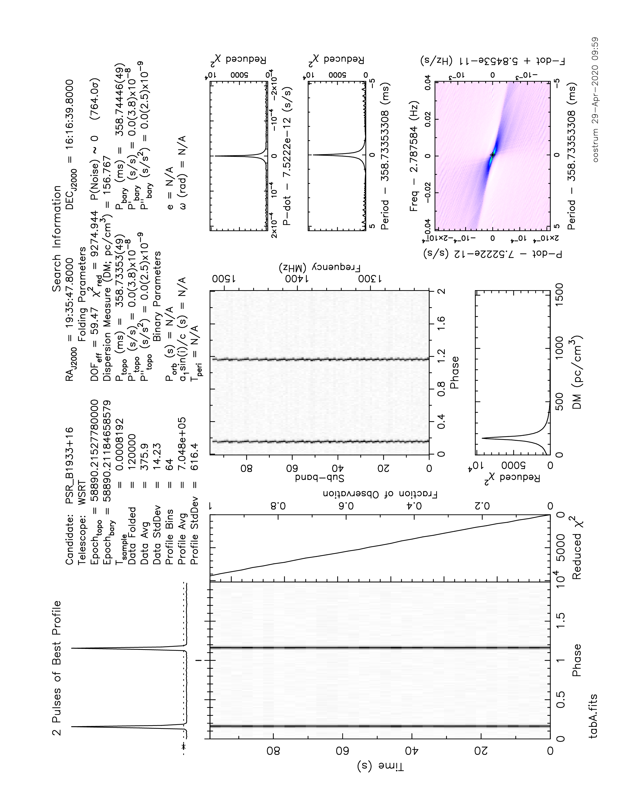

# dadafits

[](https://zenodo.org/badge/latestdoi/94994432)

Connect to a [PSRDada](http://psrdada.sourceforge.net/) ringbuffer, optionally downsample and compress, and write out the data in [FITS](https://fits.gsfc.nasa.gov/fits_home.html) format.

This program is part of the data handling pipeline for the AA-ALERT project.
See [dadatrigger](https://github.com/AA-ALERT/dadatrigger) for an introduction and dataflow schema.

# Usage

```bash
 $ dadafits -k <hexadecimal key> -l <logfile> -t <template_directory> -d <output_directory> -S <synthesized beam table> -s <synthesize these beams>
```

Command line arguments:
 * *-k* Set the (hexadecimal) key to connect to the ringbuffer.
 * *-l* Absolute path to a logfile (to be overwritten)
 * *-t* Template directory (defaults to the directory **templates** in the current working directory)
 * *-d* Output directory
 * *-S* Synthesized beam table
 * *-s* Selection of synthesized beams

# Modes of operation

## As part of the real-time pipeline 

These modes are for archiving data; the program can be run as part of the real-time pipeline.

### Science modes

The program implements different modes:
- mode 0: Stokes I + IAB (incoherent beams, so only one "tied-array" beam)
- mode 2: Stokes I + TAB (multiple tied-array beams)

In these modes data is also:
* integrated over time to reduce sample rate to 1250 samples per 1.024 seconds
* summed over frequencies to reduce total number of frequencies to 768
* compressed to 1 bit

For details see [this section below](#downsampling-and-compression).

## Science cases

The data input rate is set per science case.
Supported cases:
- case 3: 12500 samples per second, 9 beams
- case 4: 12500 samples per second, 12 beams

## As part of an event-based postprocessing step

These modes are for analysing event data, and are not optimized for real-time use.

### Science modes

The program implements different modes:
- mode 1: Stokes IQUV + IAB
- mode 3: Stokes IQUV + TAB

### Science cases

The data input rate is set per science case.
Supported cases:
- case 3: 12500 samples per second, 9 beams
- case 4: 12500 samples per second, 12 beams

# The ringbuffer

## Header block

Metadata is read from the PSRDada header block, and copied to the FITS header.
Note that much of the metadata available in the header block is ignored, due to code constraints and optimizations.

For values that should be present see the table below.

|header key      | type    | units | description | notes |
|----------------|---------|-------|-------------|-------|
| MIN\_FREQUENCY | double  | Mhz                 | Center of lowest frequency band of observation    |  |
| BW             | double  | Mhz                 | Total bandwidth of observation                    |  |
| PADDED\_SIZE   | int     | bytes               | Length of the fastest dimension of the data array |  |
| SCIENCE\_CASE  | int     | 1                   | Mode of operation of ARTS, determines data rate   | Must be 3 or 4 |
| SCIENCE\_MODE  | int     | 1                   | Mode of operation of ARTS, determines data layout | Either 0,1,2, or 3 |
| RA\_HMS        | string  | HH:MM:SS.ssss       | Right ascension                                   | maps to RA |
| DEC\_HMS       | string  |+HH:MM:SS.ssss       | Declination                                       | maps to DEC |
| SCANLEN        | float   | seconds             | Requested observation length                      | maps to SCANLEN |
| FREQ           | float   | degrees             | Center frequency                                  | maps to OBSFREQ |
| SOURCE         | string  | text                | Source name                                       | maps to SRC\_NAME |
| UTC\_START     | char    | YYYY-MM-DDTHH:MM:SS | Human readable timestamp of the start of the observation. | The program will silently modify the separators to conform to FITS standard. However, whitespace characters as in '2018-04-18 14:40:10' will not work | maps to DATE-OBS |
| MJD\_START     | double  | days since epoch    | Modified Julian Date                              | maps to STT\_IMJD and STT\_SMJD |
| LST\_START     | double  | degrees             | Local siderial time                               | maps to STT\_LST |
| AZ\_START      | float   | degrees             | Azimuth angle of telescope                        | set per row in the SUBINT binary table as TEL\_AZ, assumed constant over the run |
| ZA\_START      | float   | degrees             | Zenith angle of telescope                         | set per row in the SUBINT binary table as TEL\_ZEN, assumed constant over the run |
| PARSET         | string  |                     | Parameter file for the observation                | maps to PARSET |

## Data block

For modes 0 and 2 (ie Stokes I data), a ringbuffer page is interpreted as an array of Stokes I: [NTABS, NCHANNELS, padded\_size]
Array padding along the fastest dimension is implemented to facilitate memory copies.

For modes 1 and 3 (ie Stokes IQUV), a ringbuffer page is an interleaved array: [tab, channel\_offset, sequence\_number, packet]
Where:
- tab ranges from 0 to 0 (IAB) or 9 (science case 3 TAB) or 11 (science case 4 TAB)
- channel\_offset ranges from 0 upto 383 (NCHANNELS/4 - 1)
- sequence\_number ranges from 0 upto 24
- packet is a direct copy of a UDP datapacket coming from the network, making up 8000 bytes

The packet itself is an array: [time, channel, polarization]
where:
- time runs from 0 to 499, to get actual time, *sequence\_number * 500* should be added
- channel runs from 0 to 4, to get actual channel, *channel\_offset * 4* should be added
- polarization stands for the 4 Stokes components, IQUV.

# FITS output files

Output files are created in the directory specified on the commandline.
A template is used for the FITS file and is selected based on science case and mode.
Templates are searched for in the **template** directory in the current working directory; or its location can be specified as a command line argument.

Data is stored one beam per file.

For TAB the filename is ```tabX.fits```, where X indicates the TAB number. A=0, B=1, etc.
For synthesized beams the filename is ```synXX.fits```, where XX is the synthesized beam number

# Building

To connect to the PSRDada ring buffer, we depend on PSRDada code. Ensure PSRDada is compiled with shared libraries enabled and ```libpsrdada.so``` can be found through ```LD_LIBRARY_PATH```.
Building is done using CMake:
```bash
  mkdir build && cd build
  cmake ../
  make && make install
```

# Downsampling and compression

Compression to one bit is done for each batch of 1.024 seconds, and each frequency channel, independently.
Downsampling is done by simple summation.

First, we calculate the average and standard deviation.
Then, each sample is encoded as 0 (equal to, or below average) or 1 (above average).

The average and standard deviation are stored in the FITS file as ```offset``` and ```scale```, where:
```
offset = avg - std
scale = 2.0 * std
```

Combined, the downsampling and compression achieve a reduction in data size of a factor ~140 compared to the
filterbank output format (See also [dadafilterbank](https://github.com/AA-ALERT/dadafilterbank)).
A factor 20 is achieved from the reduction in time and frequency resolution, another factor 7 by 1-bit compression.

The reduced resolution of the data imply that transient events can only be detected if they are very bright. 
However, for periodic signals many pulses can be summed and the pulse profile extracted. An example of a pulsar signal in 1-bit downsampled data is shown here:



# Synthesized beams

The tied-array beams can be combined to form synthesized beams; providing more accurate localisation.
A synthesized beam is a linear combination (simple sum) of tied-array beams.

The synthesized beam table lists per synthesized beam the constituent tied-array beams.
The following rules apply:
 * allow comments: everything following a '#'  until the next newline is a comment, lines starting with '#' are ignored
 * any and all white space is ignored and is only relevant for separating the numbers
 * completely empty lines are ignored

The indexing scheme is as follows:
 * tied-array beams must be numbered from 0 (central beam) to NTABS - 1
 * a higher tied-array beam index implies a position right or westward of the center
 * the middle synthesised beam index denotes the central position (e.g. 35 if there are 71 synthesized beams in total)
 * a lower synthesised beam index implies a position right or westward of the center
 * a higher synthesised beam index implies a position left or eastward of the center

An example synthesised beam table for 12 TABs and 71 SBs is included:
[sbtable-sc4-12tabs-71-sbs.txt](static/sbtable-sc4-12tabs-71-sbs.txt)

# Parameterset
The observation parameterset is a string of key-value pairs. Keys and values are separated by ```=```, 
white space around the separator is ignored. Key-value pairs are separated by a newline character. 
The parameterset is first compressed with ```bz2``` compression, then encoded with ```hex```encoding. 
The encoded parset is then stored to the FITS header in the ```PARSET``` field.

# Performance

For offline processing of IQUV data, the data are first read from disk into a PSRDada ringbuffer. ```dadafits```then
deinterleaves these data and writes them to disk in FITS format.
Writing either 12 tied-array beams or one synthesised beam to disk takes roughly 13 seconds
per page of 1.024 seconds.

# Contributers

Jisk Attema, Netherlands eScience Center  
Leon Oostrum, ASTRON / UvA  
Gijs Molenaar, Pythonic.nl

# NOTES

